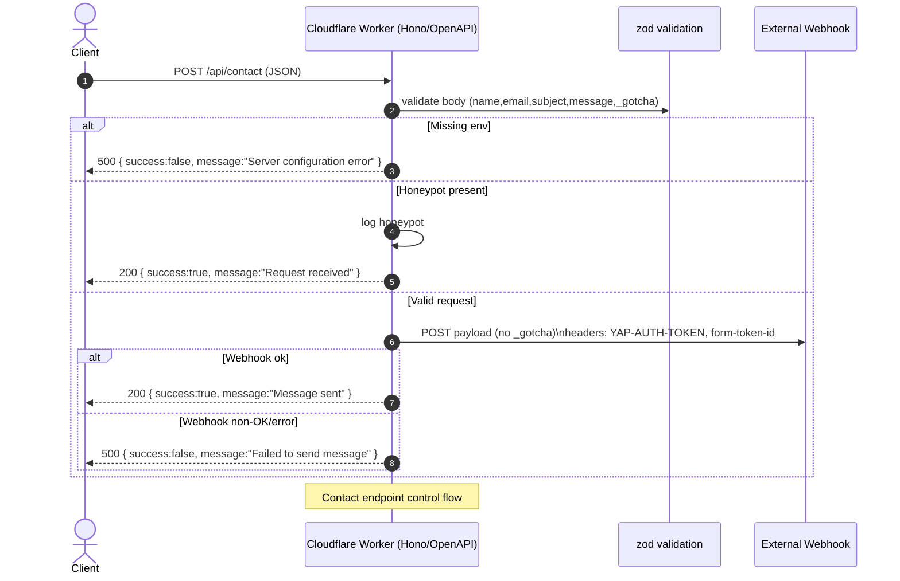

# Contact endpoint — details

This document describes the control flow for the `POST /api/contact` endpoint implemented by the Cloudflare Worker (Hono + OpenAPI).



## Purpose

Receive contact messages from the website and forward them to an external webhook (for example: an n8n webhook). The endpoint performs input validation, honeypot spam filtering and forwards a minimal payload to the webhook with authentication headers.

### Request

- Path: `POST /api/contact`
- Content-Type: `application/json`

Example request body:

```json
{
  "name": "John Doe",
  "email": "john@example.com",
  "subject": "Question about your service",
  "message": "Hello — I would like to know more about...",
  "_gotcha": ""
}
```

Notes:

- `_gotcha` is a honeypot field. Legitimate clients should send it as an empty string or omit it. If the field contains any value, the request is treated as spam and it's accepted silently (200) but not forwarded.

### Validation rules

- `name`: required, non-empty string
- `email`: required, valid email format, max length 254 (ReDoS-safe validation)
- `subject`: required, non-empty string
- `message`: required, non-empty string
- `_gotcha`: optional string (honeypot)

Validation is implemented with `zod` and integrated into the OpenAPI route. If validation fails, the worker returns a 400 response with a JSON error.

### Environment variables (required)

The Worker reads these values from the `Env` bindings / Cloudflare secrets:

- `WEBHOOK_AUTH_TOKEN` — authentication token forwarded to the webhook via header `YAP-AUTH-TOKEN`
- `WEBHOOK_FORM_TOKEN_ID` — form token ID forwarded to the webhook via header `form-token-id`
- `CONTACT_WEBHOOK_URL` — fully qualified URL of the external webhook

If any of these are missing the endpoint returns 500 with `{ success: false, message: "Server configuration error" }`.

### Outgoing webhook payload

The worker forwards a minimal JSON payload to the configured webhook (omitting `_gotcha`):

```json
{
  "name": "John Doe",
  "email": "john@example.com",
  "subject": "Question about your service",
  "message": "Hello — I would like to know more about..."
}
```

Headers included in the webhook request:

- `Content-Type: application/json`
- `YAP-AUTH-TOKEN: <WEBHOOK_AUTH_TOKEN>`
- `form-token-id: <WEBHOOK_FORM_TOKEN_ID>`

### Responses

- 200 OK — success
  - body: `{ success: true, message: "Message sent successfully" }` when forwarded and the webhook returns OK
  - body: `{ success: true, message: "Request received" }` when honeypot triggered (accepted silently)
- 400 Bad Request — validation failed
  - body: `{ success: false, message: "Invalid request" }`
- 405 Method Not Allowed — any method except POST
- 500 Internal Server Error — configuration or forwarding error
  - body: `{ success: false, message: "Server configuration error" }` or `{ success: false, message: "Failed to send message" }`

### Logging and observability

- Honeypot triggers are logged as warnings (to help tune spam controls).
- Webhook errors are logged with the remote status code.
- Unexpected exceptions are logged as errors and return a 500 to the client.

### Troubleshooting

- If you see `Missing webhook configuration in environment variables` in logs, ensure Cloudflare secrets are set:

```bash
wrangler secret put WEBHOOK_AUTH_TOKEN
wrangler secret put WEBHOOK_FORM_TOKEN_ID
wrangler secret put CONTACT_WEBHOOK_URL
```

- If webhooks fail (500 from remote), check network access and verify the remote webhook accepts your `YAP-AUTH-TOKEN` and `form-token-id` headers.

- If real requests are being blocked as spam, review the form markup and ensure the honeypot field `_gotcha` is hidden client-side (but present) and empty for real users.

### Security notes

- Email validation limits input length and uses a ReDoS-safe regex to prevent regex Denial-of-Service.
- The worker does not persist form data.
- All secrets should be stored as Cloudflare secrets (not committed to the repo).

### Tests

There are unit tests that cover the contact endpoint behavior, including:

- Schema validation
- Honeypot behavior
- Missing environment variables
- Webhook success/failure
- Network error handling

Look at `apps/api/src/endpoints/contact.test.ts` for the test cases.
