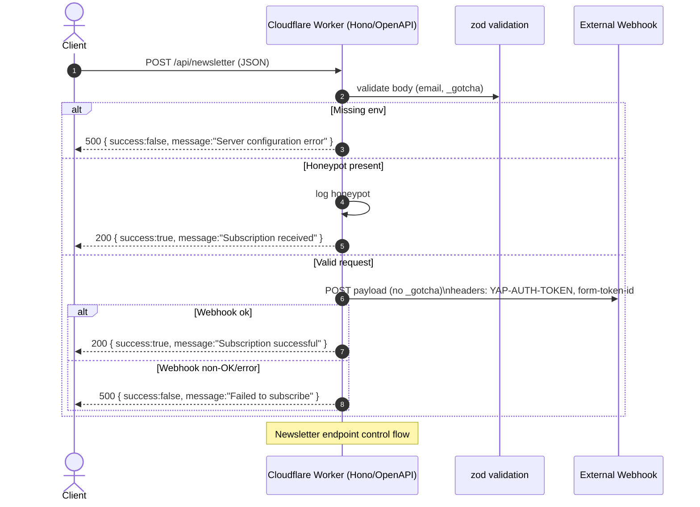
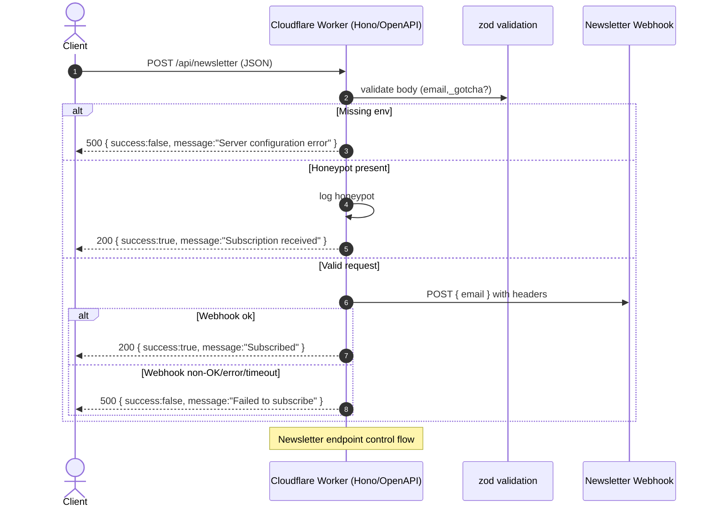

# Newsletter endpoint — details

This document describes the control flow for the `POST /api/newsletter` endpoint implemented by the Cloudflare Worker (Hono + OpenAPI).



## Purpose

Accept newsletter subscription requests and forward the validated email to an external webhook. The endpoint validates email addresses, protects against bots using a honeypot field and forwards the minimal payload to the webhook with authentication headers.

### Request

- Path: `POST /api/newsletter`
- Content-Type: `application/json`

Example request body:

```json
{
  "email": "subscriber@example.com",
  "_gotcha": ""
}
```

Notes:

- `_gotcha` is the honeypot. If it's present with a value the request will be accepted (200) but not forwarded.

### Validation rules

- `email`: required, valid email format, max length 254 (ReDoS-safe regex)
- `_gotcha`: optional string (honeypot)

Validation uses `zod` and the OpenAPI route layer to reject invalid requests with 400 responses.

### Environment variables (required)

- `WEBHOOK_AUTH_TOKEN` — forwarded as `YAP-AUTH-TOKEN`
- `WEBHOOK_FORM_TOKEN_ID` — forwarded as `form-token-id`
- `NEWSLETTER_WEBHOOK_URL` — fully qualified webhook URL

Missing any of these results in a 500 `{ success: false, message: "Server configuration error" }`.

### Outgoing webhook payload

```json
{
  "email": "subscriber@example.com"
}
```

Headers included in the webhook request:

- `Content-Type: application/json`
- `YAP-AUTH-TOKEN: <WEBHOOK_AUTH_TOKEN>`
- `form-token-id: <WEBHOOK_FORM_TOKEN_ID>`

### Responses

- 200 OK — success
  - `{ success: true, message: "Subscription successful" }` when webhook returns OK
  - `{ success: true, message: "Subscription received" }` when honeypot triggered
- 400 Bad Request — validation failed
  - `{ success: false, message: "Invalid email address" }`
- 405 Method Not Allowed — any method except POST
- 500 Internal Server Error — configuration or forwarding error
  - `{ success: false, message: "Server configuration error" }` or `{ success: false, message: "Failed to subscribe" }`

### Logging and observability

- Honeypot triggers and webhook errors are logged.
- Validation failures are surfaced as 400 responses.

### Troubleshooting

- Ensure Cloudflare secrets are set:

```bash
wrangler secret put WEBHOOK_AUTH_TOKEN
wrangler secret put WEBHOOK_FORM_TOKEN_ID
wrangler secret put NEWSLETTER_WEBHOOK_URL
```

- If subscription attempts return 500, verify the webhook accepts the headers used and the URL is reachable.

### Security notes

- Use a conservative email regex and max length to avoid ReDoS.
- Do not store sensitive webhook tokens in the repository; use secrets.

### Tests

Unit tests covering the newsletter endpoint exist at `apps/api/src/endpoints/newsletter.test.ts`.

