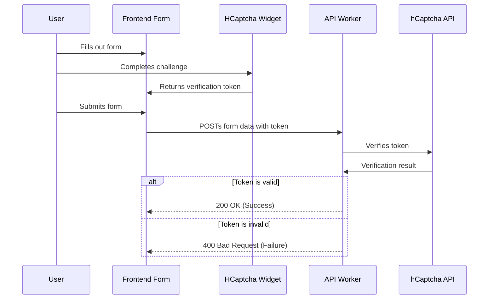

# Guide: hCaptcha Security Implementation

This document describes the hCaptcha implementation for bot protection on the contact and newsletter forms.

## 1. Overview

hCaptcha is a CAPTCHA service that protects the site from bots and spam while respecting user privacy. This project uses hCaptcha v1 with both client-side and server-side verification to ensure that form submissions come from real users.

## 2. How It Works: Architecture

### Client-side Flow

1. **Render**: The `HCaptcha.astro` component renders the hCaptcha widget on the page.
2. **User Interaction**: The user completes the CAPTCHA challenge.
3. **Token Generation**: Upon success, hCaptcha generates a one-time token.
4. **Submission**: The token is included in the form data when the user submits the form.

### Server-side Flow

1. **Receive Request**: The Cloudflare Worker API endpoint receives the form data, including the hCaptcha token.
2. **Verify Token**: The worker sends the token to the hCaptcha API for verification.
3. **Process Form**: If the token is valid, the worker processes the form submission (e.g., forwards it to a webhook). If invalid, it rejects the request.



## 3. Setup and Configuration

To get hCaptcha working, you need to configure a public **Site Key** for the frontend and a private **Secret Key** for the backend.

### Step 1: Get hCaptcha Keys

1. Go to your hCaptcha dashboard: <https://dashboard.hcaptcha.com/>
2. Select your site (e.g., `yunielacosta.com`).
3. Copy the **Site Key** and the **Secret Key**.

### Step 2: Configure the Portfolio (Client-side)

Add the public **Site Key** to the `.env` file in the `apps/portfolio/` directory.

**File**: `apps/portfolio/.env`

```env
PUBLIC_HCAPTCHA_SITE_KEY=32849c48-cf0a-400c-b678-8e74992eadc4
```

### Step 3: Configure the API Worker (Server-side)

The private **Secret Key** must be configured as an encrypted secret in your Cloudflare Worker.

#### Option 1: Use the Wrangler CLI (Recommended)

```bash
# Navigate to the API directory
cd apps/api

# Set the secret
pnpm wrangler secret put HCAPTCHA_SECRET_KEY
```

When prompted, paste your hCaptcha **Secret Key**.

#### Option 2: Use the Cloudflare Dashboard

1. Navigate to the [Cloudflare Dashboard](https://dash.cloudflare.com/).
2. Go to **Workers & Pages** and select your API worker.
3. Go to **Settings** > **Variables**.
4. Under **Environment Variables**, click **Add variable**.
5. Set the name to `HCAPTCHA_SECRET_KEY` and paste your secret key as the value.
6. Click **Encrypt** and then **Save**.

### Step 4: Local Development Setup

To run the API worker locally, create a `.dev.vars` file in the `apps/api` directory and add your secret key.

```bash
# Navigate to the API directory
cd apps/api

# Create the file and add the secret
echo "HCAPTCHA_SECRET_KEY=YOUR_SECRET_KEY_HERE" >> .dev.vars
```

> **Note**: The `.dev.vars` file is included in `.gitignore` and should not be committed to source control.

## 4. Implementation Details

### Frontend Components

- **`HCaptcha.astro`**: A reusable component at `apps/portfolio/src/components/atoms/HCaptcha.astro` that handles loading the hCaptcha script and rendering the widget.
- **Form Integrations**: The widget is integrated into the contact form (`Contact.astro`) and the newsletter form (`CtaNewsletterSubscription.astro`). Client-side scripts in these components ensure a token is present before allowing a form to be submitted.

### Backend Verification

- **Verification Utility**: A function at `apps/api/src/utils/hcaptcha.ts` handles the communication with the hCaptcha `siteverify` API endpoint.
- **API Endpoints**: The `contact.ts` and `newsletter.ts` endpoints in `apps/api/src/endpoints/` both call the verification utility before processing any data. If verification fails, they return a `400 Bad Request` error.

## 5. Testing

hCaptcha provides a set of test keys that always pass or fail, allowing for safe testing without real challenges.

- **Test Site Key**: `10000000-ffff-ffff-ffff-000000000001`
- **Test Secret Key**: `0x0000000000000000000000000000000000000000`

You can temporarily use these in your `.env` and `.dev.vars` files to test the integration flow. **Remember to replace them with your actual production keys before deploying.**

### How to Test for Errors

1. **Missing Token**: Submit a form without completing the CAPTCHA. The UI should block it.
2. **Invalid Token**: Manually alter the token in your browser's developer tools before submission. The API should return a 400 error.
3. **Expired Token**: Complete the CAPTCHA, wait for more than 2 minutes, and then submit the form. The API should return a 400 error.

## 6. Troubleshooting

- **Widget Not Rendering?**
  - Check the browser console for script-loading errors.
  - Verify the `PUBLIC_HCAPTCHA_SITE_KEY` in your `.env` file is correct.
- **Verification Always Fails?**
  - Ensure the `HCAPTCHA_SECRET_KEY` is set correctly in your Cloudflare secrets.
  - Check the worker logs for any error messages using `pnpm wrangler tail`.
