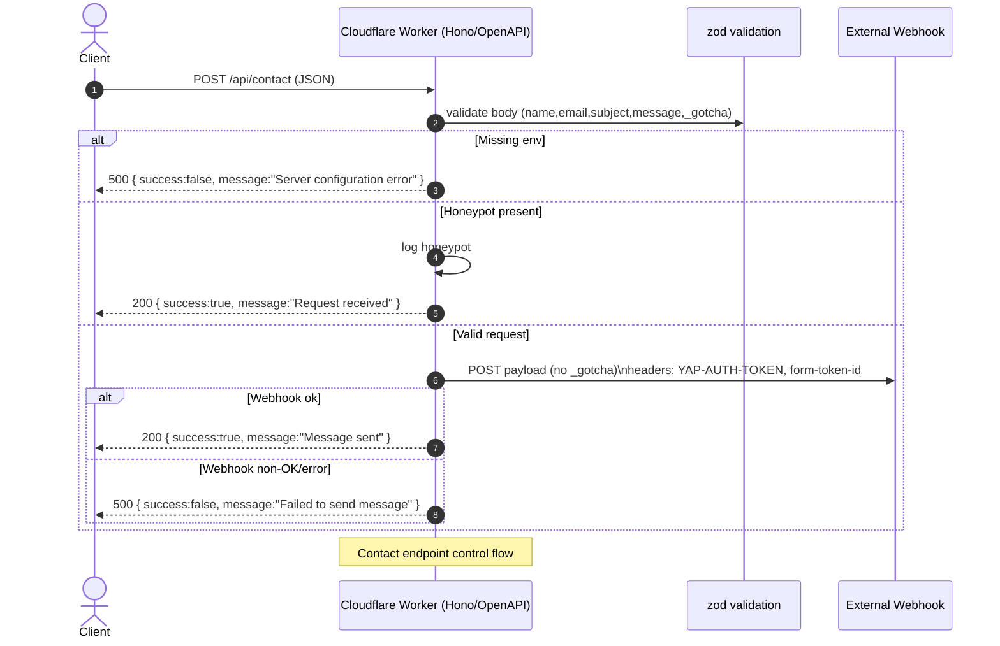
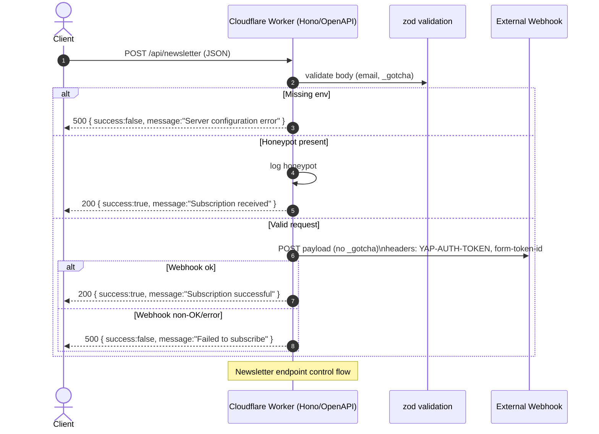

# API Endpoint Reference

This document provides a detailed technical reference for the API endpoints exposed by the Cloudflare Worker.

## `POST /api/contact`

Receives contact form submissions and forwards them to an external webhook.

### Control Flow



### Request Body

```json
{
  "name": "John Doe",
  "email": "john@example.com",
  "subject": "Question about your service",
  "message": "Hello — I would like to know more about...",
  "_gotcha": "" // Honeypot field, must be empty
}
```

### Validation Rules

-   `name`: Required, non-empty string.
-   `email`: Required, valid email format, max length 254.
-   `subject`: Required, non-empty string.
-   `message`: Required, non-empty string.
-   `_gotcha`: Optional string (honeypot field).

### Required Environment Variables

-   `WEBHOOK_AUTH_TOKEN`
-   `WEBHOOK_FORM_TOKEN_ID`
-   `CONTACT_WEBHOOK_URL`

---

## `POST /api/newsletter`

Accepts newsletter subscription requests and forwards the email to an external webhook.

### Control Flow



### Request Body

```json
{
  "email": "subscriber@example.com",
  "_gotcha": "" // Honeypot field, must be empty
}
```

### Validation Rules

-   `email`: Required, valid email format, max length 254.
-   `_gotcha`: Optional string (honeypot field).

### Required Environment Variables

-   `WEBHOOK_AUTH_TOKEN`
-   `WEBHOOK_FORM_TOKEN_ID`
-   `NEWSLETTER_WEBHOOK_URL`

---

## Common Behaviors

### Responses

-   **200 OK**: The request was successful.
-   **400 Bad Request**: Input validation failed.
-   **500 Internal Server Error**: A server-side error occurred (e.g., missing configuration, webhook failure).

### Security

-   **Honeypot**: Both endpoints use a `_gotcha` field to trap simple bots. If this field has a value, the API returns a successful response but does not process the request.
-   **ReDoS-Safe Validation**: Email validation uses a secure regex to prevent Regular Expression Denial of Service attacks.

### Testing

Unit tests for both endpoints can be found in:
-   `apps/api/src/endpoints/contact.test.ts`
-   `apps/api/src/endpoints/newsletter.test.ts`

```