# Tasks: Implementar soporte completo de externalArticles en páginas de tags

**Input**: Design documents from `/specs/002-implementar-soporte-completo/`
**Prerequisites**: plan.md, spec.md (user stories), research.md, data-model.md, quickstart.md

**Tests**: Per Constitution and NFR-002, tests are REQUIRED. Include unit tests for combination/filter/dedupe and E2E test for tag page with only external articles.

**Organization**: Tasks are grouped by user story to enable independent implementation and testing of each story.

## Format: `[ID] [P?] [Story] Description`

- **[P]**: Can run in parallel (different files, no dependencies)
- **[Story]**: Which user story this task belongs to (e.g., US1, US2, US3)
- Include exact file paths in descriptions

## Path Conventions

Project structure: Monorepo at repo root, target app: `apps/portfolio/`

---

## Phase 1: Setup (Shared Infrastructure)

**Purpose**: Verify existing tooling and prepare for feature work

- [ ] T001 Verify Biome and TypeScript strict mode pass on current branch (`pnpm check` from repo root)
- [ ] T002 Verify existing test harness (Vitest for unit/integration, Playwright for E2E) runs without errors
- [ ] T003 [P] Read and understand current `article.service.ts` and `article.mapper.ts` logic (apps/portfolio/src/core/article/)
- [ ] T004 [P] Read and understand current tag page template logic (apps/portfolio/src/pages/[lang]/blog/tag/[tag].astro)

**Checkpoint**: Setup complete - ready to implement foundational API

---

## Phase 2: Foundational (Blocking Prerequisites)

**Purpose**: Core API that ALL user stories depend on - MUST complete before any story implementation

**⚠️ CRITICAL**: No user story work can begin until this phase is complete

- [ ] T005 Design and implement `getAllArticlesIncludingExternal(criteria?)` function in `apps/portfolio/src/core/article/article.service.ts`
  - Fetch both `articles` and `externalArticles` collections
  - Apply `draft: false` filter to both
  - Apply `lang` filter using `parseEntityId(id).lang`
  - Map external entries using `toArticles` (handle type compatibility)
  - Deduplicate by `article.id`
  - Return combined `Article[]` array
- [ ] T006 Add unit tests for `getAllArticlesIncludingExternal` in `apps/portfolio/src/core/article/article.service.test.ts` or similar
  - Test: filters drafts correctly
  - Test: filters by lang correctly
  - Test: deduplicates by id (if same id in both collections)
  - Test: combines results from both collections
  - Test: returns empty array when no matches

**Checkpoint**: Foundation API ready and tested - user stories can now use it

---

## Phase 3: User Story 1 - Ver tags con contenido (Priority: P1) 🎯 MVP

**Goal**: Visitors can see tag pages with articles even if all articles are external (e.g., `/en/blog/tag/r`)

**Independent Test**: Navigate to `/en/blog/tag/r` after build - page exists and lists ≥1 external article

### Tests for User Story 1 (REQUIRED) ⚠️

Write/run these tests to verify the story works.

- [ ] T007 [P] [US1] Add E2E test for tag page with only external articles in `apps/portfolio/tests/e2e/tag-pages.spec.ts` (or create new file)
  - Test scenario: Visit `/en/blog/tag/r` and verify page loads, shows ≥1 article, no 404
  - Test scenario: Visit a tag page with mixed internal+external articles and verify combined list
- [ ] T008 [P] [US1] Add integration test for tag page article filtering/combination in vitest test file
  - Mock/fixture: tag with only external articles
  - Verify: list includes external articles

### Implementation for User Story 1

- [ ] T009 [US1] Update `apps/portfolio/src/pages/[lang]/blog/tag/[tag].astro` to use `getAllArticlesIncludingExternal` in page body (line ~39+)
  - Replace `await getArticles()` call with `await getAllArticlesIncludingExternal()`
  - Maintain current filter logic for `tagArticles` (filter by tag slug and lang)
  - Keep pagination logic unchanged
- [ ] T010 [US1] Run `pnpm check` from repo root to verify no Biome/TS errors introduced
- [ ] T011 [US1] Run `pnpm -w test` to verify unit and E2E tests pass
- [ ] T012 [US1] Manually verify in local dev (`pnpm dev` in apps/portfolio) that `/en/blog/tag/r` renders and lists external article(s)

**Checkpoint**: US1 complete - tag pages now show external articles; MVP delivered ✅

---

## Phase 4: User Story 2 - Generación de rutas de tags completa (Priority: P2)

**Goal**: Static build generates routes for ALL tags with content (internal or external), avoiding 404s

**Independent Test**: Inspect build output routes; confirm `/en/blog/tag/r` route exists after static build

### Tests for User Story 2 (REQUIRED) ⚠️

- [ ] T013 [P] [US2] Add unit test for `getStaticPaths` logic in tag page (or integration test via build check)
  - Verify: paths include tags with only external articles
  - Verify: paths exclude tags with no articles or only drafts

### Implementation for User Story 2

- [ ] T014 [US2] Update `getStaticPaths()` function in `apps/portfolio/src/pages/[lang]/blog/tag/[tag].astro` (line ~13+)
  - Replace `await getArticles()` with `await getAllArticlesIncludingExternal()`
  - Maintain lang loop and tag loop
  - Ensure `tagArticles.length > 0` check includes combined results
- [ ] T015 [US2] Run static build locally (`pnpm build` from apps/portfolio) and verify no errors
- [ ] T016 [US2] Inspect build output (dist/ or .astro/) for presence of `/en/blog/tag/r` route
- [ ] T017 [US2] Run `pnpm check` to confirm no linting/type errors

**Checkpoint**: US2 complete - all tags with content generate routes ✅

---

## Phase 5: User Story 3 - Conmutación de idioma sin roturas (Priority: P3)

**Goal**: Language switcher maintains tag context or falls back gracefully when switching languages

**Independent Test**: Use tag locale utilities to verify paths for tags with/without equivalents in target language

### Tests for User Story 3 (REQUIRED) ⚠️

- [ ] T018 [P] [US3] Add unit test for `getTagLocalePaths` behavior with combined articles in `apps/portfolio/src/core/tag/tag-locale.service.test.ts` (or similar)
  - Test: tag with equivalent in both langs returns correct paths
  - Test: tag with no equivalent in target lang returns fallback path (`/[lang]/tag`)

### Implementation for User Story 3

- [ ] T019 [US3] Verify that `getTagLocalePaths` in `apps/portfolio/src/core/tag/tag-locale.service.ts` works correctly with external articles
  - Review: `findTagInLanguage` uses `getTags({ lang })` which is independent of articles
  - Confirm: no changes needed unless tag existence now depends on article existence (current logic seems fine)
- [ ] T020 [US3] If changes are needed, update `tag-locale.service.ts` and add corresponding tests
- [ ] T021 [US3] Manually test language switching on a tag page in local dev (switch from `/en/blog/tag/r` to `/es/blog/tag/r` or fallback)

**Checkpoint**: US3 complete - language switching works correctly for tag pages ✅

---

## Phase 6: Polish & Cross-Cutting Concerns

**Purpose**: Final refinements, edge case handling, and performance validation

### Edge Cases & Validation

- [ ] T022 [P] Add test for edge case: tag with all articles as `draft: true` - verify route NOT generated
- [ ] T023 [P] Add test for edge case: pagination correctness with combined article count > postsPerPage
- [ ] T024 [P] Verify deduplication works if same `id` appears in both collections (unit test)

### Performance & Quality Gates

- [ ] T025 Measure Core Web Vitals for tag page after changes (LCP, INP, CLS) in local build
  - Document results in PR or feature notes
  - Verify: LCP ≤ 2.5s, INP ≤ 200ms, CLS < 0.1
- [ ] T026 Run full test suite (`pnpm -w test`) and ensure all tests pass with no flakiness
- [ ] T027 Run `pnpm check` final verification (Biome + TypeScript strict)
- [ ] T028 Manual accessibility check: verify tag page navigation, focus, and semantic HTML unchanged

### Documentation

- [ ] T029 Update any relevant in-repo docs if behavior changed (e.g., README, /docs if applicable)
- [ ] T030 Update AGENTS.md or copilot-instructions.md if new patterns/conventions introduced (likely not needed for this feature)

**Checkpoint**: Feature complete and polished ✅

---

## Dependencies & Execution Order

```mermaid
graph TD
    Setup[Phase 1: Setup]
    Foundation[Phase 2: Foundation API]
    US1[Phase 3: US1 - Ver tags]
    US2[Phase 4: US2 - Generación rutas]
    US3[Phase 5: US3 - Conmutación idioma]
    Polish[Phase 6: Polish]
    
    Setup --> Foundation
    Foundation --> US1
    Foundation --> US2
    Foundation --> US3
    US1 --> Polish
    US2 --> Polish
    US3 --> Polish
```

**Critical Path**: Setup → Foundation → US1 (MVP)

**User Story Dependencies**:

- US1, US2, US3 can be implemented in parallel after Foundation is complete
- US1 is the MVP - prioritize completion first
- US2 and US3 are enhancements and can follow

---

## Parallel Execution Opportunities

### Within Foundation (Phase 2)

- T006 (unit tests) can run in parallel with T005 (implementation) if using TDD approach

### Within User Stories

- Tests (T007, T008, T013, T018) can be written in parallel for different stories
- US1, US2, US3 implementations are independent and can be developed in parallel after Foundation

### Within Polish (Phase 6)

- T022, T023, T024 (edge case tests) can run in parallel
- T025 (performance), T026 (tests), T027 (lint), T028 (a11y) can run in parallel

---

## Implementation Strategy

**MVP Scope**: Phase 1 + Phase 2 + Phase 3 (US1 only)

- Delivers: Tag pages show external articles, fixing 404/empty pages
- Est. Tasks: T001-T012 (12 tasks)

**Full Feature**: All phases

- Delivers: Complete solution with route generation and i18n support
- Est. Tasks: T001-T030 (30 tasks)

**Recommended Approach**:

1. Complete Setup + Foundation (T001-T006) - 6 tasks
2. Deliver US1 as MVP (T007-T012) - 6 tasks
3. Add US2 for complete route generation (T013-T017) - 5 tasks
4. Add US3 for i18n completeness (T018-T021) - 4 tasks
5. Polish and validate (T022-T030) - 9 tasks

---

## Task Summary

- **Total Tasks**: 30
- **Setup**: 4 tasks
- **Foundation**: 2 tasks (blocking)
- **US1 (P1 - MVP)**: 6 tasks
- **US2 (P2)**: 5 tasks
- **US3 (P3)**: 4 tasks
- **Polish**: 9 tasks
- **Parallel Opportunities**: ~15 tasks can run in parallel within their phases
- **Independent Test Points**: 3 (one per user story)
